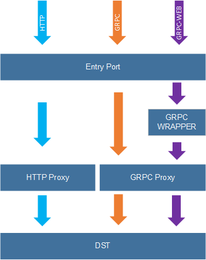

# rproxy

rproxy为平台提供透明的反向代理

## 支持的协议

| 协议     | 说明                   |
| -------- | ---------------------- |
| HTTP 1.* |
| GRPC     | 基于HTTP2.0的原生GRPC  |
| GRPC-WEB | 基于HTTP1.1的WEB端GRPC |
 

## 代理结构

